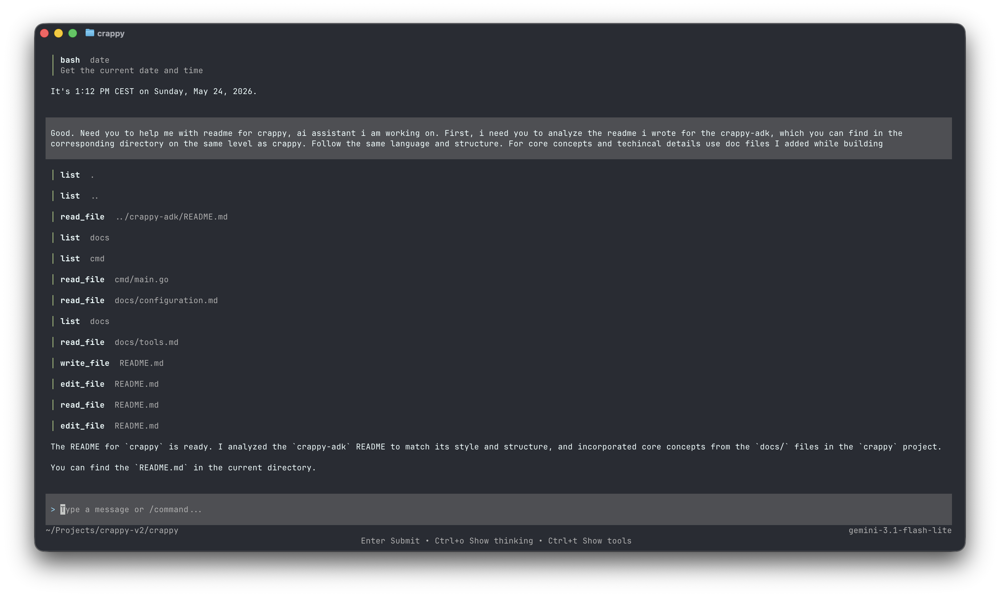

# Crappy AI

<div align="center">
  <br/><br/>

  [](https://golang.org)
  [](LICENSE)
</div>

A small terminal AI assistant for work on your machine.

Built on [crappy-adk](https://github.com/vitaliiPsl/crappy-adk). It adds a TUI, configuration, sessions, permissions, built-in tools, and model/provider setup.

## Motivation

Wanted to build my own small assistant.

## Install

```sh
git clone https://github.com/vitaliiPsl/crappy-ai
cd crappy-ai
go build -o "$(go env GOPATH)/bin/crappy" ./cmd
```

Requires Go 1.26.2.

## Quick Start

Set an API key and run Crappy:

```sh
export OPENAI_API_KEY=...
crappy
```

Crappy creates these files on first run:

```text
~/.crappy-ai/config.yaml
~/.crappy-ai/settings.yaml
```

Use flags for a one-off model change:

```sh
crappy -provider openai -model gpt-5.5 -thinking high
```

## Configuration

`config.yaml` is for assistant behavior:

```yaml
provider: anthropic
model: claude-sonnet-4-6
thinking: medium

permissions:
  default: ask
  allow:
    - tool: list
      pattern: "./**"
    - tool: read_file
      pattern: "./**"
```

`settings.yaml` is for local setup:

```yaml
providers:
  - name: openai
    api: openai
    api_key_env: OPENAI_API_KEY
```

See [Configuration](docs/configuration.md).

## Models

Provider entries map a selected `name` to an API dialect:

- `anthropic` uses Anthropic's Messages API
- `openai` uses OpenAI's Responses API
- `google` uses Google's Gemini API

Custom providers can point at compatible endpoints:

```yaml
providers:
  - name: openai-local
    api: openai
    base_url: http://localhost:11434/v1
    api_key: local

models:
  openai-local:
    - id: gemma4
      context_window: 131072
```

See [Models and Providers](docs/models.md).

## Tools and Permissions

Crappy has tools for files, web pages, and shell commands:

- `list` shows what is in a directory before Crappy decides what to read.
- `read_file` gives Crappy source, docs, config, and other text files as context.
- `write_file` creates a new file or replaces a whole file when that is the right edit.
- `edit_file` changes existing files by replacing exact text.
- `web_fetch` reads public pages when a task depends on external documentation.
- `bash` runs commands such as tests, formatters, linters, and project scripts.

Permissions decide whether each tool call is allowed, denied, or asks first:

```yaml
permissions:
  default: ask
  allow:
    - tool: read_file
      pattern: "./docs/**"
  deny:
    - tool: bash
      pattern: "rm *"
```

See [Tools](docs/tools.md) and [Permissions](docs/permissions.md).

## Sessions and Memory

Sessions store conversation history, tool activity, usage, and the working directory for a thread of work.

Memory is session-scoped. Continuing a session sends its message history back to the model. Long sessions can be compacted into a summary, and future turns continue from the latest summary plus newer messages.

Crappy also reads `AGENTS.md` and `CLAUDE.md` instruction files from the working directory and its ancestors. Use them for shared conventions, workflows, and build/test notes that should be visible in every turn.

See [Sessions](docs/sessions.md) and [Memory and Context](docs/memory.md).
